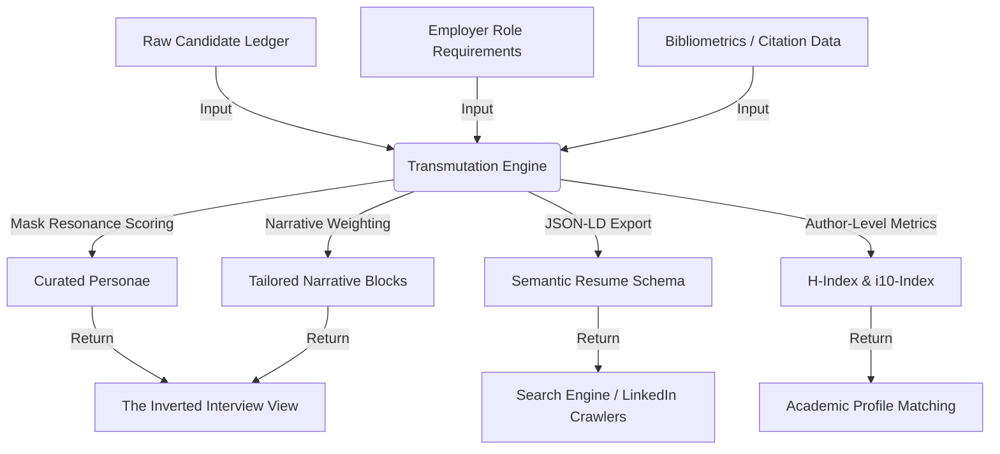

# Alchemical I/O (Source & Transmutation)

This document maps the inputs, processing transformations, and resulting returns generated by the `in-midst-my-life` engine.

## Source Inputs
1. **Candidate Identity Ledger**: Cryptographically-ready records of roles, achievements, skills, and personal thesis definitions.
2. **Employer Query Profiles**: Captured values, cultural expectations, tech stack needs, and organizational requirements from the Inverted Interview.
3. **Bibliometrics (Academic)**: Citation numbers, publication statuses, author credits, and publication formats.

## Transmutation Processes
1. **Mask Matching**: Comparing the tags, context, and preferences of an employer query against the candidate's masks using 5-factor similarity scoring.
2. **Narrative Formatting**: Transforming raw CV data into contextual HTML or markdown streams, dynamically adjusting sections based on calculated relevance weights.
3. **Semantic Serialization**: Generating rich, crawler-friendly JSON-LD schemas representing professional profiles.

## Outputs and Returns
1. **The Inverted Interview View**: A customized portfolio showcasing only the most relevant achievements, narrative explanations, and a calculated alignment score.
2. **Standardized exports**: Compliant, machine-readable JSON-LD and web-sharing views of the candidate's CV.
3. **Bibliometric summary**: Stateless reports showing author-level impact metrics (H-index, i10-index, total citations) for scholars.
